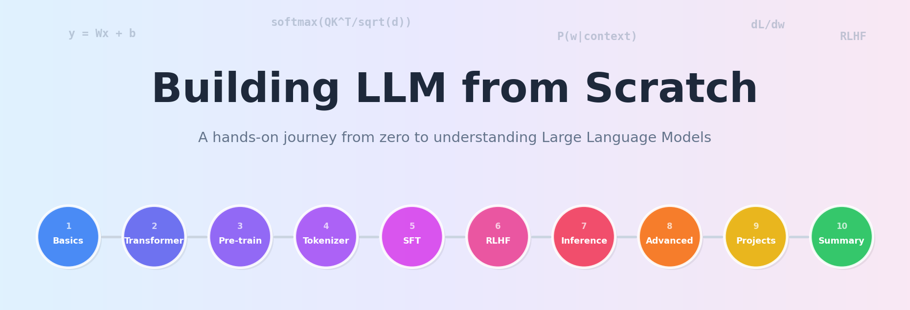

  

  
  
  

# Building LLM from Scratch

> 无深度学习背景软件工程师的大模型学习&实践笔记。

> 从零学习&实验 Transformer、预训练、微调、RLHF 的完整流程。由浅入深，理论讲解 + 实验代码，完整构建gpt2-small参数量小语言模型。学习并实践最新高级技巧与优化方法，如KV Cache优化、MoE、推理模型等。

## What You'll Learn

### 学习路径：

| 阶段 | 你会学到什么 | 学完能做什么 |
|------|------------|------------|
| **基础** | 张量、神经网络、Attention、Transformer 架构 | 看懂任何模型的结构和参数 |
| **预训练** | 数据处理、Tokenizer、训练循环、文本生成 | 从零训练一个能生成文本的小模型 |
| **微调** | SFT、LoRA、指令数据集设计 | 让模型学会按指令回答问题 |
| **对齐** | RLHF、奖励模型、PPO、DPO | 理解模型为什么会"听话" |
| **优化** | KV Cache、量化、Speculative Decoding | 让模型跑得更快、更省资源 |
| **前沿** | MoE、长文本、多模态 | 看懂最新论文和技术趋势 |
| **实战** | 代码助手、RAG 问答、推理模型 | 独立构建完整的 LLM 应用 |

### Final Output

完成全部课程后，你将：
- **从零构建并训练一个小型语言模型**（预训练 + SFT + RLHF 全流程）
- **理解大模型从数据到部署的每一个环节**，遇到问题能定位根因而不是盲目调参
- **具备阅读最新 AI 论文的能力**，能判断新技术的价值和适用场景

## Chapter Format

每章包含：
- **chapter-XX.ipynb** — 理论讲解 + 实践代码合一，可直接在 Kaggle (免费 T4 GPU) 上运行
- **README.md** — 学习目标、核心知识点、FAQ
- **images/** — 手绘风格的概念图

## Progress

### Stage 1: 基础准备与环境搭建

| Chapter | Topic | Status |
|---------|-------|--------|
| [Chapter 01](Chapter-01/) | 大模型的前世今生 | Done |
| [Chapter 02](Chapter-02/) | 搭建 Kaggle 开发环境 | Done |
| [Chapter 03](Chapter-03/) | 张量与神经网络基础 | Done |
| [Chapter 04](Chapter-04/) | 词嵌入（Embedding）的奥秘 | Done |
| [Chapter 05](Chapter-05/) | 注意力机制的直觉理解 | Done |
| [Chapter 06](Chapter-06/) | Transformer 架构全景 | Done |
| [Chapter 07](Chapter-07/) | 位置编码：让模型理解顺序 | Done |
| [Chapter 08](Chapter-08/) | 阶段总结：构建迷你 Transformer | Done |

### Stage 2-10

Coming soon.

## Tech Stack

- **Platform**: Kaggle (Free T4 GPU, 30hrs/week)
- **Language**: Python
- **Framework**: PyTorch, Hugging Face Transformers

## License

MIT
